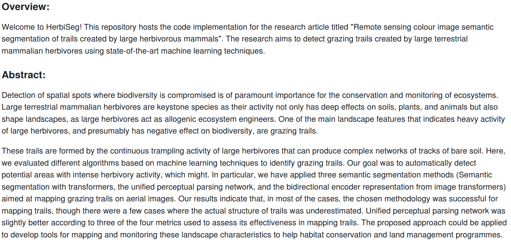
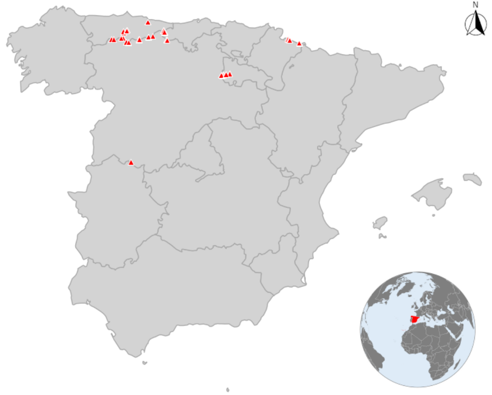

### README.md:

---

## HerbiSeg: Semantic Segmentation for Large Herbivore Grazing Trails Detection

Study area. Spain map. The images of grazing trails come from
mountain passes of the Cantabrian mountain range (red rectangle)

