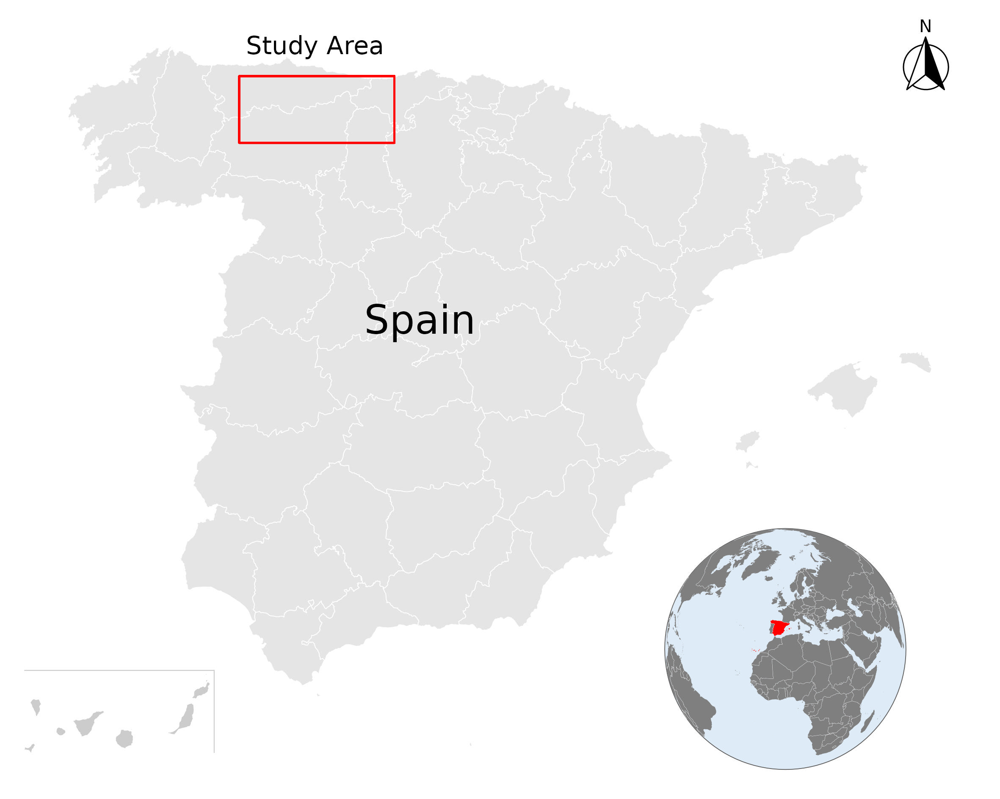

### README.md:

---

## HerbiSeg: Semantic Segmentation for Large Herbivore Grazing Trails Detection

### Overview:

Welcome to HerbiSeg! This repository hosts the code implementation for the research article titled "Remote sensing colour image semantic segmentation of trails created by large herbivorous mammals". The research aims to detect grazing trails created by large terrestrial mammalian herbivores using state-of-the-art machine learning techniques.

### Abstract:

Detection of spatial spots where biodiversity is compromised is of paramount importance for the conservation and monitoring of ecosystems. Large terrestrial mammalian herbivores are keystone species as their activity not only has deep effects on soils, plants, and animals but also shape landscapes, as large herbivores act as allogenic ecosystem engineers. One of the main landscape features that indicates heavy activity of large herbivores, and presumably has negative effect on biodiversity, are grazing trails.

These trails are formed by the continuous trampling activity of large herbivores that can produce complex networks of tracks of bare soil. Here, we evaluated different algorithms based on machine learning techniques to identify grazing trails. Our goal was to automatically detect potential areas with intense herbivory activity, which might. In particular, we have applied three semantic segmentation methods (Semantic segmentation with transformers, the unified perceptual parsing network, and the bidirectional encoder representation from image transformers) aimed at mapping grazing trails on aerial images. Our results indicate that, in most of the cases, the chosen methodology was successful for mapping trails, though there were a few cases where the actual structure of trails was underestimated. Unified perceptual parsing network was slightly better according to three of the four metrics used to assess its effectiveness in mapping trails. The proposed approach could be applied to develop tools for mapping and monitoring these landscape characteristics to help habitat conservation and land management programmes.

Study area. Iberian Peninsula map. The images of grazing trails come from
mountain passes of the Cantabrian mountain range (red rectangle)

### Results
 
Groundtruth                          Segformer

 
Uppernet                             BEIT

**Figure: Image 2**

### Contents:

- **/code**: Contains the implementation of the semantic segmentation algorithms used in the research.
- **/data**: Directory for storing sample data or links to datasets used in the research.

